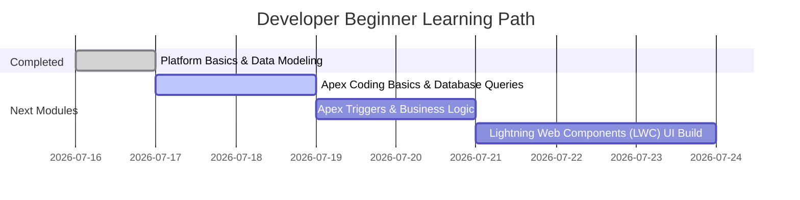

# Trailhead "Developer Beginner" Progress Report

**Date:** July 17, 2026  
**To:** Supervisor, DreamHouse Realty  
**From:** Willard Soriano, Application Developer  
**Subject:** Trailhead "Developer Beginner" Learning Path & Project Progress

---

## 1. Executive Summary

This report summarizes the progress and key outcomes of my training on the Salesforce **Developer Beginner** learning path. Using the Dreamhouse Realty app codebase, I have successfully configured the developer environment, learned the core Salesforce schema architectures, and deployed a custom database model using Salesforce DX metadata pipelines.

---

## 2. Key Accomplishments & Trailhead Modules Covered

### A. Salesforce Platform Basics & Data Modeling

I implemented custom schema updates to support the broker workflow. This aligned with the database customization standards covered in the Data Modeling module:

- **Custom Object (`Offer__c`):** Built a custom object schema to model property offers, utilizing an Auto Number naming format (`OF-{0000}`) starting at index `1`.
- **Currency Custom Field (`Offer_Amount__c`):** Created a currency database field with standard precision (18, 2) to capture numeric monetary figures.
- **Date Custom Field (`Target_Close_Date__c`):** Implemented a date field to log the purchase negotiation deadline.

### B. Platform Development Workflows

- Transitioned from browser-based point-and-click schemas to a code-first Salesforce DX workflow.
- Staged the codebase structure in Git under `feature/offer-object` and deployed using the Salesforce CLI.

---

## 3. Roadblocks & Beginner Developer Learnings

During environment provisioning and metadata verification, several technical roadblocks were encountered and resolved:

### Local Hardware Limitations & Cloud Offloading

- _Learning:_ Heavy local tools (VS Code extensions and local agent orchestration) can exceed the limits of an 8 GB RAM local machine.
- _Resolution:_ Successfully pivoted the workspace to a 16 GB Hetzner VM, establishing a headless dev stack while using local terminal ssh to connect.

### VS Code Extension & Compilation Diagnostics

- _Learning:_ The VS Code Apex Extension requires a dedicated JDK runtime configured in settings.
- _Resolution:_ Installed the default JDK globally and pointed the `salesforce.salesforcedx-vscode-apex.java.home` setting directly to the Java directory (`/usr/lib/jvm/default-java`).

### Salesforce CLI Connection & Default Org Setup

- _Learning:_ Authorizing an environment using `sf org login web` does not automatically make it the default deployment target.
- _Resolution:_ Learned to set the default target org config key (`sf config set target-org trailhead-playground`) to resolve `NoDefaultEnvError` during metadata deployment.

---

## 4. Next Milestones & Training Roadmap

1.  **Apex Coding & SOQL Queries (Next Module):**
    Write the `HouseService` Apex controller in the project directory using SOQL query filters.
2.  **Apex Triggers:**
    Implement automated workflow scripts to handle state transitions for Offer records.
3.  **LWC Visuals:**
    Develop a custom listing component using the Lightning framework.
