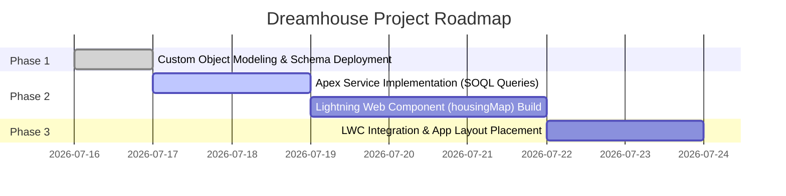

# Dreamhouse Development Progress Report

**Date:** July 17, 2026  
**To:** Supervisor, DreamHouse Realty  
**From:** Willard Soriano, Lead Developer  
**Subject:** Dreamhouse Realty Application Development Progress Update

---

## 1. Executive Summary

This report summarizes the current development status of the Dreamhouse Realty custom application implementation. The environment configuration, core data architecture modeling, and deployment pipelines have been successfully established. We are currently executing the feature implementation roadmap, starting with the property purchase workflow and target close date tracking features.

---

## 2. Key Accomplishments & Features Delivered

### Core Custom Object Modeling (Offer Object)

We have designed and deployed the custom **Offer** schema to Salesforce. This object allows brokers to record and track buyer offers, pricing, and purchase timelines.

- **Auto Numbering System:** Configured the record name as an auto-incrementing field formatted as `OF-{0000}`, starting at number `1` for clear record cataloging.
- **Currency Tracking (`Offer_Amount__c`):** Created a custom Currency field with a precision of 18 digits and a scale of 2 decimal places to capture transactional offer amounts.
- **Timeline Tracking (`Target_Close_Date__c`):** Created a custom Date field to track close dates for sales negotiations.

### Version Control & CI/CD Staging

To maintain quality control and support peer review:

- Initialized source-controlled metadata repository tracking.
- Created isolated feature branch `feature/offer-object`.
- Opened Pull Request #1 on GitHub to stage changes for main branch review.

---

## 3. Engineering Key Learnings & Operational Roadblocks

To ensure project resilience and optimal development speed, several engineering roadblocks were analyzed, bypassed, and documented during this sprint:

### A. Local Hardware Optimization & Scaling

- **Challenge:** The initial local developer machine (8 GB RAM) experienced memory exhaustion (OOM) under concurrent execution of the Salesforce model context servers and Node dependencies.
- **Resolution:** Provisioned and scaled the development environment to a **Hetzner CX43 VM** (4 vCPUs, 16 GB RAM). This resolved all performance bottlenecks and ensured clean multitasking.

### B. Workspace Tooling & CLI Resilience

- **Challenge:** Local VS Code Electron runtime crashed on startup due to corrupted GPU caches.
- **Resolution:** Transitioned seamlessly to a **CLI-first, keyboard-centric workflow** via remote SSH. Bypassed graphics overhead by utilizing terminal-based code readers (`less`), lightweight editors (`gedit`/`nano`), and manual command-line deployments.
- **GPU Cache Fix:** Documented a local terminal routine (`rm -rf ~/.config/Code/GPUCache`) to fix the underlying local Electron issue.

### C. Salesforce Org Target Environment Routing

- **Challenge:** Encountered `NoDefaultEnvError` during metadata deployment because the initial login flow set the playground as a default DevHub (`target-dev-hub`), but left the active target org (`target-org`) unassigned.
- **Resolution:** Configured the CLI target-org default value explicitly (`sf config set target-org trailhead-playground`), securing persistent, direct deployments to the playground.

### D. Package Manager Mirror Mismatches

- **Challenge:** Intermittent checksum/hash sum failures during `sudo apt full-upgrade` caused by upstream Netdata repository synchronization delays.
- **Resolution:** Placed temporary holds on Netdata packages (`sudo apt-mark hold ...`) to decouple them from core OS and security package upgrades, allowing system updates to finish.

---

## 4. Project Milestones & Next Steps

1.  **Apex Service Implementation (Next Task):**
    Write the `HouseService` Apex controller in the `force-app/main/default/classes/` directory to run security-enforced SOQL queries for filtering properties.
2.  **Lightning Web Component (LWC) Creation:**
    Build the `housingMap` component using Salesforce Lightning Base Components (`lightning-card` and `lightning-map`) to plot active listings on a map.
3.  **UI Integration:**
    Deploy the LWC bundle and place it on the Dreamhouse App Home Page layout using Lightning App Builder.
